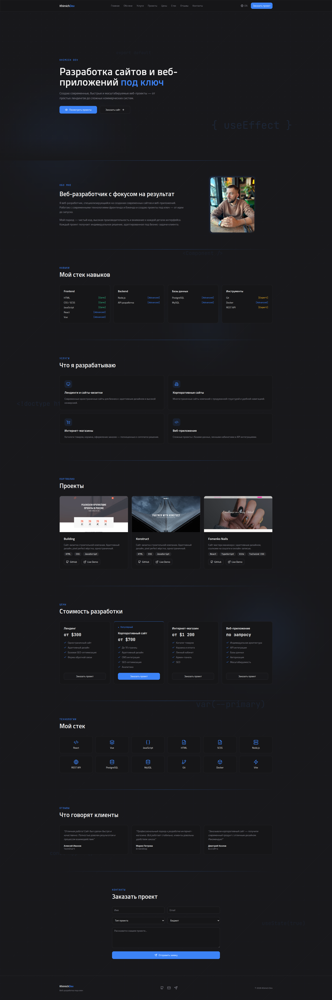

# 🖥️ Khimich Dev — Личный сайт портфолио!


---

## 📸 Превью 

[**Посмотреть LIVE-демо**](https://khimichdev.ru/)


<p align="center">
  
</p> 

> Современный, быстрый и адаптивный сайт-портфолио веб-разработчика!

---

## О проекте

Персональный сайт-портфолио веб-разработчика **Khimich Dev**. Сайт демонстрирует навыки, услуги, реализованные проекты и позволяет клиентам оставить заявку через встроенную форму.

### Возможности

- 🌍 **Двуязычность** — полная поддержка русского и английского языков
- 📱 **Адаптивный дизайн** — отлично выглядит на всех устройствах
- ⚡ **Высокая производительность** — построен на Vite + React
- 🎨 **Современный UI** — использует shadcn/ui компоненты
- 📬 **Форма заявки** — с валидацией Zod и уведомлениями
- 🧪 **Тестирование** — настроены Vitest и Playwright

---

## 🛠️ Технологический стек

| Категория | Технологии |
|-----------|------------|
| **Build** | Vite |
| **Language** | TypeScript |
| **Framework** | React 18 |
| **Styling** | Tailwind CSS |
| **UI Components** | shadcn/ui (Radix UI) |
| **Forms** | React Hook Form + Zod |
| **State** | TanStack React Query |
| **Routing** | React Router DOM |
| **Icons** | Lucide React |
| **Testing** | Vitest, Playwright |

---

## 🚀 Getting Started

### Установка зависимостей

```bash
npm install
# или
bun install
```

### Запуск dev-сервера

```bash
npm run dev
```

### Сборка production-версии

```bash
npm run build
```

### Предпросмотр сборки

```bash
npm run preview
```

### Запуск тестов

```bash
npm run test        # однократно
npm run test:watch  # в режиме watch
```

---

## 📁 Структура проекта

```
src/
├── assets/          # Изображения и статические файлы
├── components/      # React компоненты
│   └── ui/          # UI компоненты shadcn/ui
├── contexts/        # React контексты (язык)
├── hooks/           # Кастомные хуки
├── lib/             # Утилиты
├── pages/           # Страницы приложения
└── test/            # Тесты
```

---

## 📄 Лицензия

Copyright © 2024 Александр Химич. All rights reserved

---

## 👨‍💻 Автор

**MrMurlok** — веб-разработчик

- GitHub: [@MrMurlok](https://github.com/MrMurlok)
- Website: [khimich.dev](https://github.com/MrMurlok/KhimichDev)
